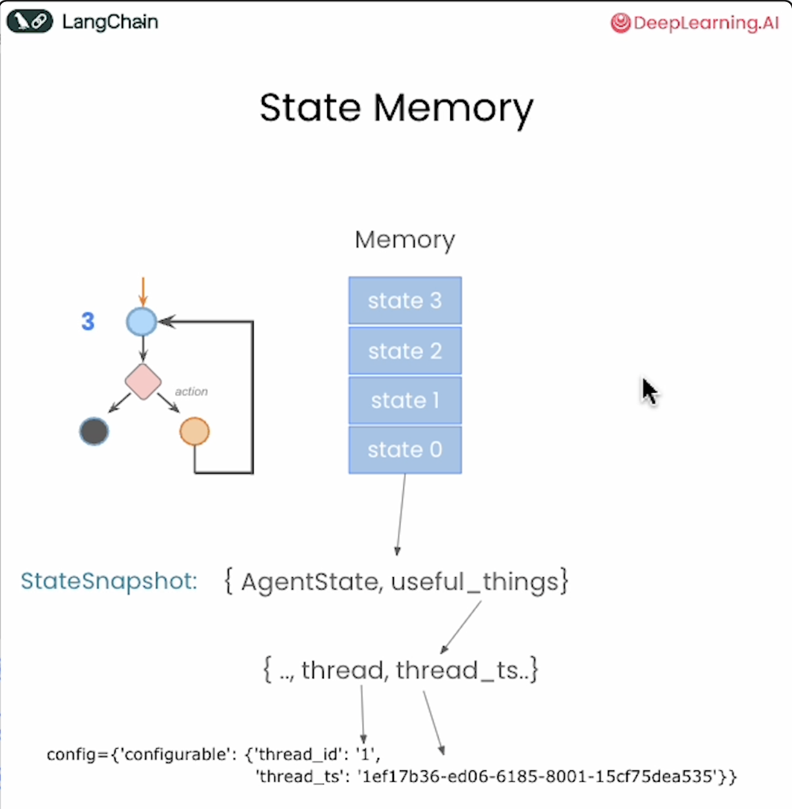
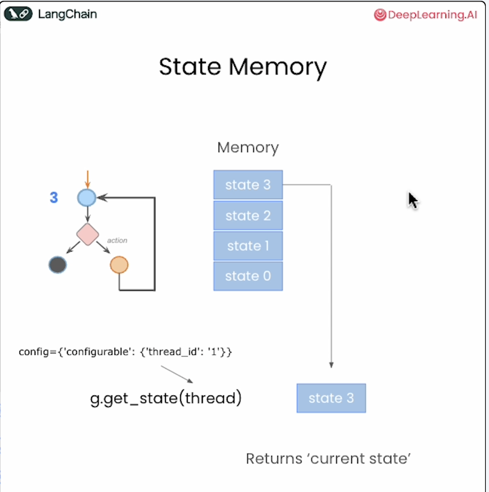
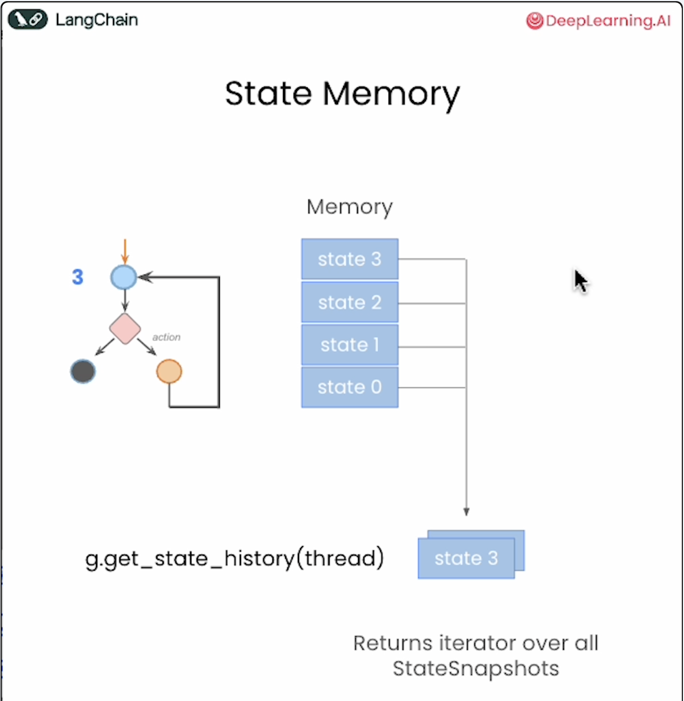
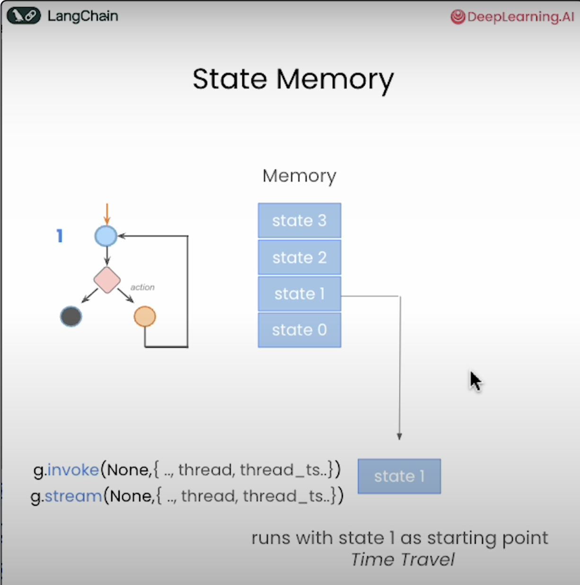
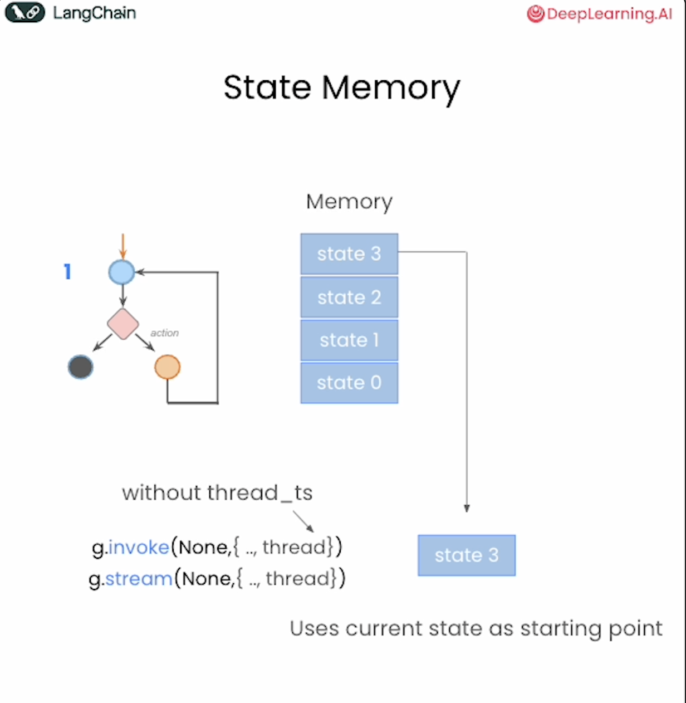
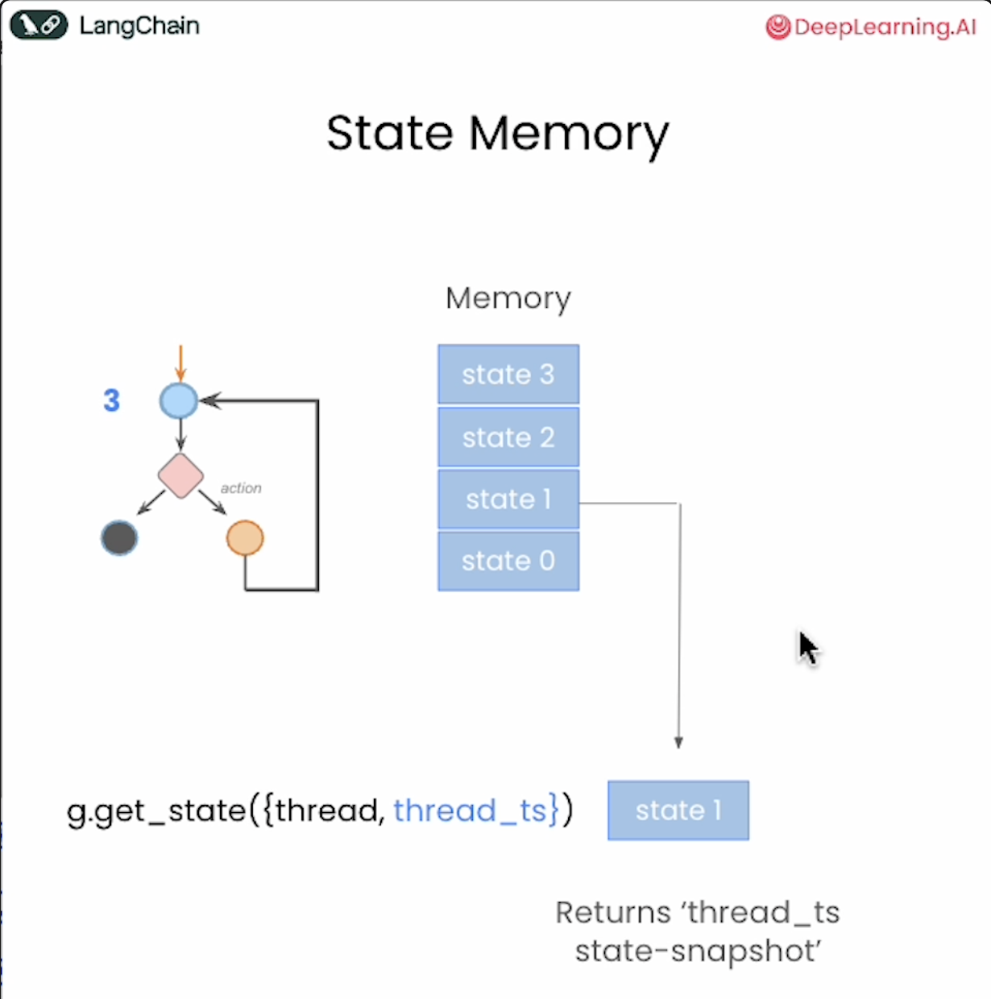
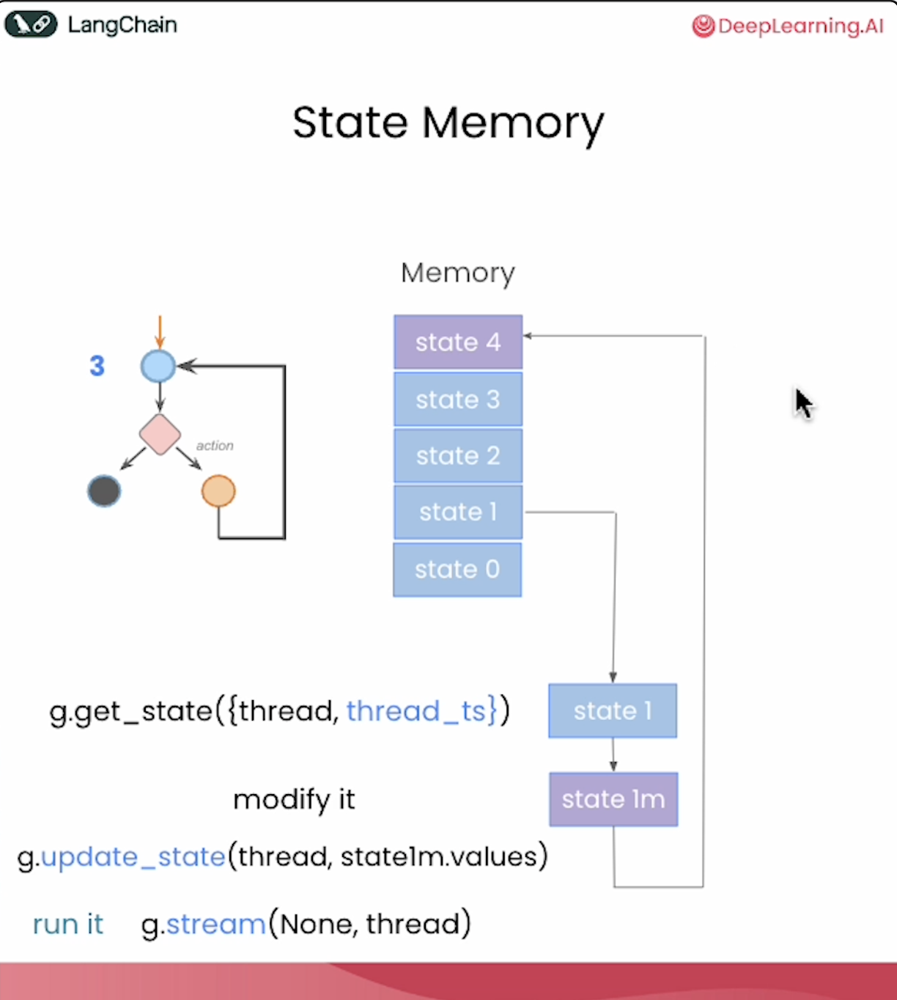

# Human-in-the-Loop Workflow

This document demonstrates the key concepts and workflow for implementing human-in-the-loop systems, where human oversight and intervention are integrated into automated processes.

## Core Concepts

### 1. State Management

*Initial state setup and configuration for the human-in-the-loop system*

### 2. Current State Retrieval

*Retrieving the current state of the system to understand the present context and status*

### 3. State History Tracking

*Accessing historical states to track changes and understand the evolution of the system over time*

### 4. Time Travel Functionality

*Ability to navigate back to previous states, enabling rollback and state restoration capabilities*

### 5. State Utilization

*Leveraging the current state information to make informed decisions and proceed with operations*

### 6. State Snapshots

*Creating and returning snapshots of the current state for backup, analysis, or sharing purposes*

### 7. State Updates

*Modifying and updating the system state based on new information, user input, or automated processes*

## Workflow Summary

The human-in-the-loop workflow follows these key principles:
- **State Persistence**: Maintaining state across interactions
- **Human Oversight**: Allowing human intervention at critical decision points
- **Reversibility**: Enabling rollback to previous states when needed
- **Transparency**: Providing clear visibility into system state and history
- **Flexibility**: Supporting both automated and manual state transitions