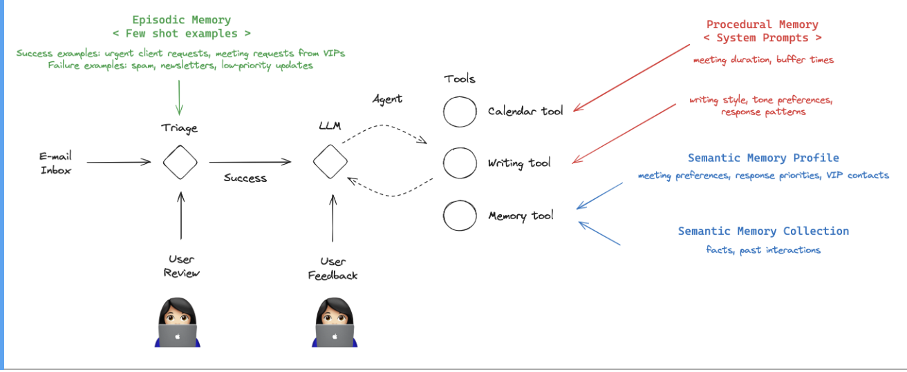

# Baseline Email Assistant¶

This lesson builds an email assistant that:

Classifies incoming messages (respond, ignore, notify)

Drafts responses

Schedules meetings

We'll start with a simple implementation - one that uses hard-coded rules to handle emails.

