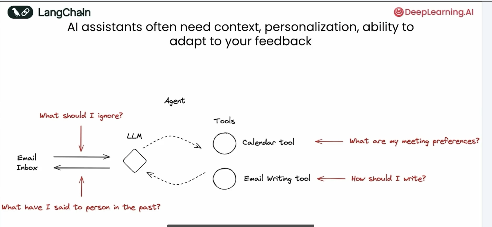
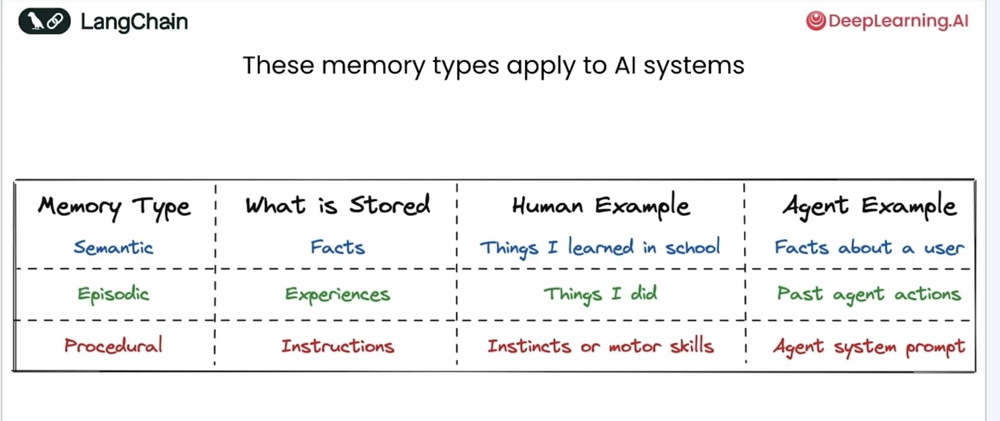
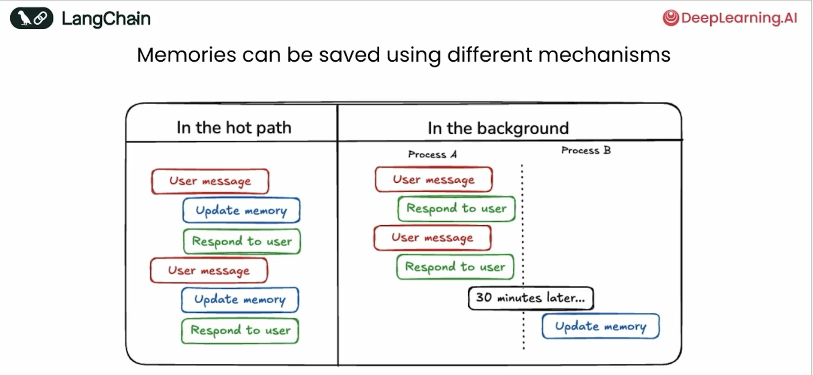

# Long-Term Agentic Memory

Building AI agents that remember and adapt to user preferences over time using LangGraph.

## AI Agent Personalization

Agents need memory to:
- Learn what to ignore from user feedback
- Remember meeting preferences and communication style
- Maintain conversation history and context

## Memory Types

| Type | Stores | Example |
|------|--------|---------|
| **Semantic** | Facts | User preferences, skills |
| **Episodic** | Experiences | Past conversations, actions |
| **Procedural** | Instructions | System prompts, behaviors |

### Examples

**Semantic Memory:**
- "John prefers 9 AM meetings"
- "Sarah is a Python developer"
- "Team uses Slack for communication"

**Episodic Memory:**
- "Discussed project deadline on Monday"
- "User canceled meeting last week"
- "Helped debug API issue yesterday"

**Procedural Memory:**
- "Always ask for confirmation before booking meetings"
- "Format code blocks with syntax highlighting"
- "Send follow-up emails within 24 hours"

## Memory Storage Approaches

**Hot Path**: Memory updates happen during conversation (slower but immediate)
**Background**: Agent responds first, updates memory later (faster response)